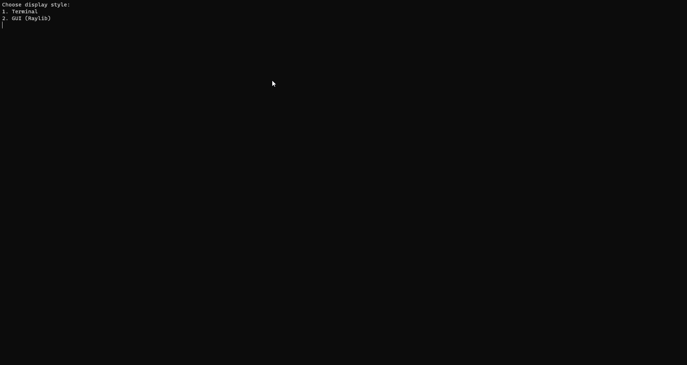

# Reach The Flag

This game was developed as a university project for the Intelligent Search Algorithms course (4th year, 1st semester).
This is the original game (https://www.puzzleplayground.com/reach_the_flag)

## Goal of The Game

The basic idea is that we have a an (n x m) grid of cells that you should walk through in order to reach the flag.

Some cells allow you to step on them only once and will disappear afterwards, while others allow multiple steps. Your goal
is to make all of the cells disappear in a way that your final position winds up at the flag cell.

You have to carefully walk the grid so that you don't get stuck in a state from which you cannot reach the flag.

## How To Play

When the game starts, select the user interface that you want:

-   Terminal Interface
-   GUI (Raylib)

The game now presents you with three levels: Easy, Medium, and Hard.

After choosing the level, you either play the game yourself (User Input), or let the computer play it.

### Keyboard Controls

W: Move up

D: Move right

S: Move down

A: Move left

### Symbols

`*`: Player position. This symbol moves as you press movement keys.

`1`: A cell that allows stepping on it only one time. Once the player steps on it, it will turn to 0.

`2`: A cell that allows stepping on it only twice. You get the idea, there might be 3, 4, 5, .etc.

`g`: Gap cell. A cell that the player cannot step on.

`f`: Flag cell. This is the cell that you're supposed to be standing on when the game finishes.

## Algorithms

The goal of this project is to demonstrate the usage of different algorithms (DFS, BFS, Uniform Cost) in a real-life scenario (in our case, a game).

Here's a list of the supported algorithms:

1. User play: You play the game through the keyboard (WASD controls only)
2. DFS: The computer will solve this game using the DFS graph traversal algorithm and display the result
3. BFS: The computer will solve this game using the BFS graph traversal algorithm and display the result
4. Uniform Cost (Dijkstra): The computer will find the shortest path between the initial player position and flag cell based on constant weights for each cell.
5. A Star (A\*): The computer will find the shortest path between the initial player position and flag cell based on a heuristic cost function.
6. Uniform Cost (path finding): Find shortest path from player cell to flag, with respect to the cells' weights
7. A Star (path finding): Same as 6

## Demo



## Maps

When you start the application, you can choose one of three predefined maps to play.

You can also modify a map's JSON file to specify your own game.

### Map Structure

The JSON file is a 2D array that contains the rows of the map.

Each row item has the following format: `Cell Type (*) | Number Of Allowed Moves | Weight`

-   `Cell type (required)`: `n` for normal cells, `g` for gap cells, `f` for the flag cell, and `p` for the player cell.
-   `Number Of Allowed Moves`: How many times can the user step on a normal cell. It is not applicable for gap and flag cells.
-   `Weight` how much it costs the player to step on a cell (useful for pathfinding algorithms). `Weight` is only not applicable for gap cells.

Note that the array's dimensions have to be equal to each other (a square array that consists of `n * n` cells).

Let's examine the `Maps/medium.json` map as an example:

```json
[
    ["p10", "n12", "n13", "n12"],
    ["n14", "n13", "n13", "n12"],
    ["n15", "n13", "n13", "n13"],
    ["n16", "n14", "g", "f3"]
]
```

In this example, we have a 4 \* 4 map. In case your map is smaller, or is not square, fill the missing cells with gap cells ('g').

First row:

| Symbol in JSON file | Cell Type | Allowed number of moves | Weight |
| ------------------- | --------- | ----------------------- | ------ |
| `p10`               | Player    | 1                       | 0      |
| `n12`               | Normal    | 1                       | 2      |
| `n13`               | Normal    | 1                       | 3      |
| `n12`               | Normal    | 1                       | 2      |

Last row:

| Symbol in JSON file | Cell Type | Allowed number of moves | Weight |
| ------------------- | --------- | ----------------------- | ------ |
| `n16`               | Player    | 1                       | 6      |
| `n14`               | Normal    | 1                       | 4      |
| `g`                 | Gap       | N / A (none)            | N / A  |
| `f3`                | Flag      | N / A (infinite)        | 3      |

## Technical details

Why support two methods of display? I wanted to decouple the core of the game from the presentation layer, which allows any presentation
object that satisfies the `GameUI` interface to work with the application without knowing how the algorithms of the game work.

I'm reading extensively on design patterns and good Object-Oriented design, and I tried to apply what I learned in this project.
